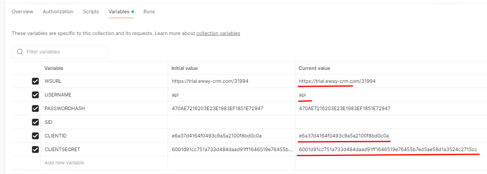
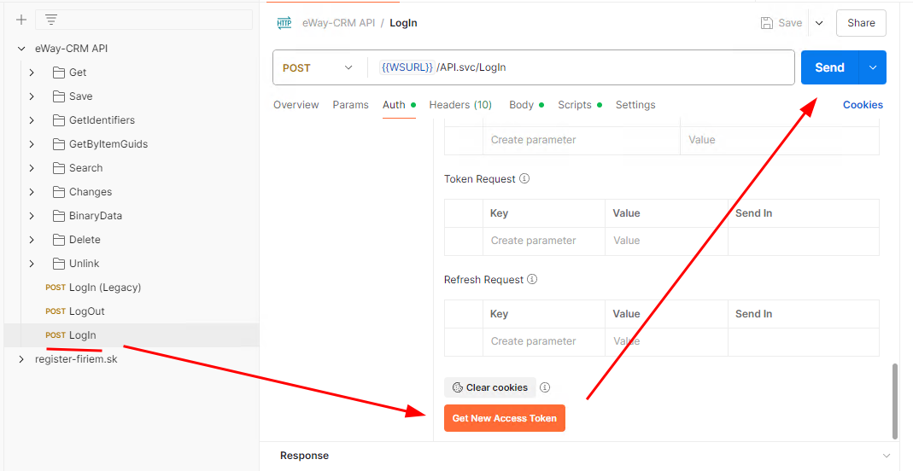
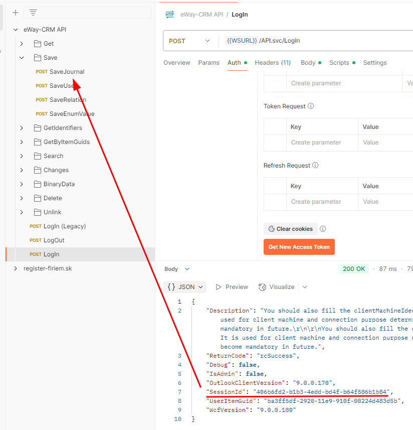
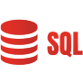
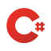

# eWay-CRM API

## First Steps

Visit the [eWay-CRM website](https://www.eway-crm.com) and sign up for a free trial.

Fork our [Postman collection](https://eway.cr/postman).

Ask our [support](mailto:support@eway-crm.com) to generate ClientID / ClientSecret for you.
Or use our test service:
* **WS URL**: https://free.eway-crm.com/31994
* **UserName**: api
* **Password**: ApiTrial@eWay-CRM

> [!NOTE]
> See [How to find Web Service URL](https://www.eway-crm.com/resources/how-to-use-eway-crm/set-or-change-web-service-address/).
> For production use we recommend to see [How to create a new user just for API integration](https://kb.eway-crm.com/en/faq-1/installation/how-to-create-api-user).
> Also make sure the user has [enough permissions](https://kb.eway-crm.com/en/documentation/5-administration-application/1-users/users-create-and-manage#effective-permissions) for the required operations.

Fill in your details in the Postman *Variables* tab:



Go to *Login* method and inside Auth tab click *Get New Access Token*. While you login
use the same user name as you previously specified in Postman *Variables*.



As soon as you have *Access Token* click *Send* to create new session.

With a session being generated you can start calling other methods eg. *SaveJournal* to create a new Journal in eWay-CRM.



## Docs

### Swagger


Postman collection does contain all available methods.
But you can use [Swagger Documentation](https://swagger.eway-crm.io/) to view all available API methods.

### DB Schema



It might be useful to look at [eWay-CRM Database Schema](https://dev.eway-crm.com/docs/database-schema.html).

Also see [FolderNames](FolderNames.md) for list of supported modules in eWay-CRM.

## Libraries

Depending on the technology you use you can pick one of our libraries.

### .NET, C#, F#, PowerShell



.NET developers may download our [NuGet package](https://www.nuget.org/packages/eWayCRM.API) and start coding.

```
dotnet add package eWayCRM.API
```

For basic samples in C# go to [csharp-lib repository](https://github.com/eway-crm/csharp-lib).

### JavaScript


JavaScript developers may leverage [@eway-crm/connector](https://www.npmjs.com/package/@eway-crm/connector).

```
npm i @eway-crm/connector
```

### PHP


Even thought not complete, PHP developers may include [eway.class.php](https://github.com/eway-crm/php-lib).

```
// Load API
require_once "eway.class.php";

// Create connector
$connector = new eWayConnector('https://free.eway-crm.com/31994', 'api', 'ApiTrial@eWay-CRM');
```

## FAQ

### How to login using OAuth 2.0

When eWay-CRM uses Azure Auth, OAuth 2.0 is required for eWay-CRM API.

See a full demo app: https://github.com/eway-crm/eway-crm-oauth-demo

### What OAuth Flows are support

Currently only Authorization Code flows are supported (user is involved). User needs to
login to get RefreshToken which is then used by the application on the backend.

### How to get info about recently changed items

* Methods: *GetLastItemChangeId*, *GetBaseItemChangeId*, *GetItemChangeIdentifiers*, *GetChangedItems*
* Sample: https://github.com/eway-crm/php-lib/blob/master/Examples/ChangesOnContacts/README.md

### How to save a document

* Methods: *SaveBinaryAttachment*, *SaveDocument*
* Sample: https://github.com/eway-crm/php-lib/tree/master/Examples/CreateTaskWithDocument

### How to change project Type / Status

* Method: *SaveProject*
* Sample: https://github.com/eway-crm/php-lib/tree/master/Examples/ChangeProjectStatus

### How to create GENERAL relation between items

* Method: *SaveRelation*
* Sample: https://github.com/eway-crm/php-lib/tree/master/Examples/LinkExistingItem

## Support

New eWay-CRM version upgrades may introduce some [Breaking Changes](Breaking%20Changes.md). Please read them carefully.

For general API question you may raise [issues](https://github.com/eway-crm/api/issues) in this repository.
If you use one of our libraries post the questions there:
* [.NET](https://github.com/eway-crm/csharp-lib/issues)
* [JavaScript](https://github.com/eway-crm/js-lib/issues)
* [PHP](https://github.com/eway-crm/php-lib/issues)